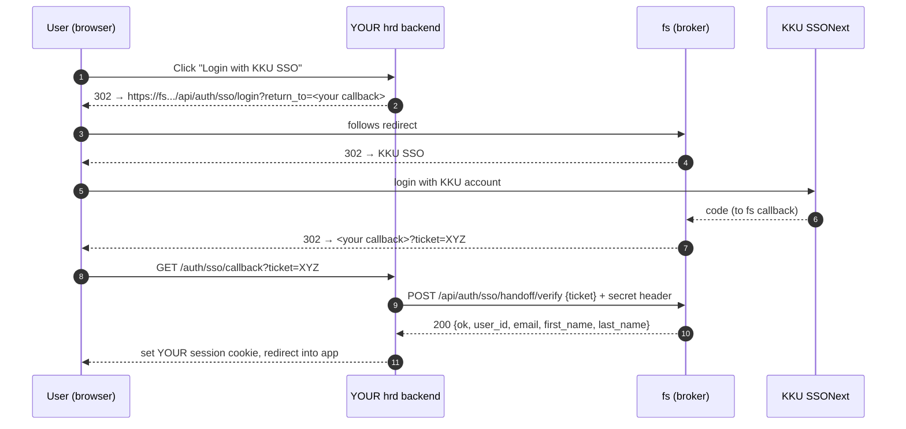

# KKU SSO Login for the HRD System — Integration Guide

> **For:** the team/AI agent building the **hrd** system
> (`https://hrd.computing.kku.ac.th`, running on its own port of the shared VM).
> **Provided by:** the "fs" system (`https://fs.computing.kku.ac.th`), which already has a working
> KKU SSO integration and will act as your **login broker**.

You do **not** need to register your own SSO app with the university. You reuse the fs system's
SSO. fs logs the user in with KKU, then hands you the user's identity through a **one-time ticket**.
You then create your **own** login session and apply your **own** roles/permissions.

---

## 0. TL;DR of what you build

1. Add a **"เข้าสู่ระบบด้วย KKU SSO"** button on your login page. It redirects the browser to the
   **fs login endpoint**, passing your own callback URL as `return_to`.
2. Add a **callback route** on your side that receives `?ticket=...`.
3. From **your backend**, call the fs **verify endpoint** with that ticket to get the user's
   identity (email, name).
4. Create **your own** session cookie and log the user in on your side.

Your normal username/password login is untouched — this is an **additional** button.

---

## 1. Values fs will give you

| Name | Meaning | Example |
|---|---|---|
| fs base URL | Where the broker lives | `https://fs.computing.kku.ac.th` |
| Client secret | Shared secret for the verify call | (a long random string — keep server-side only) |

You choose your own **callback URL**, e.g. `https://hrd.computing.kku.ac.th/auth/sso/callback`,
and tell the fs team so they add its origin to their allowlist. The origin
(`https://hrd.computing.kku.ac.th`) must exactly match (scheme + host, HTTPS only).

> The university must first create the subdomain `hrd.computing.kku.ac.th` (DNS → the VM +
> TLS cert + reverse proxy to your port). That request is handled by the fs owner, not by you.

---

## 2. The flow



---

## 3. Step 1 — the login button (browser redirect)

Send the user to the fs login endpoint. **URL-encode** your callback URL.

```
https://fs.computing.kku.ac.th/api/auth/sso/login?return_to=https%3A%2F%2Fhrd.computing.kku.ac.th%2Fauth%2Fsso%2Fcallback
```

HTML example:
```html
<a href="https://fs.computing.kku.ac.th/api/auth/sso/login?return_to=https%3A%2F%2Fhrd.computing.kku.ac.th%2Fauth%2Fsso%2Fcallback">
  เข้าสู่ระบบด้วย KKU SSO
</a>
```

- Requirements for `return_to`: **HTTPS**, and its origin must be on the fs allowlist. If it is not
  allowed, fs ignores it and the user just lands on the fs home page — so make sure the fs team has
  allowlisted your exact origin.
- You may include your own query params in the callback URL (e.g. `?next=/dashboard`); fs preserves
  them and adds `ticket`.

---

## 4. Step 2 + 3 — your callback route (server side)

When the user returns to `https://hrd.computing.kku.ac.th/auth/sso/callback?ticket=XYZ`, your
**backend** exchanges the ticket. **Do this from the server, never from browser JavaScript** (so the
client secret and the identity stay server-side).

### Request
```
POST https://fs.computing.kku.ac.th/api/auth/sso/handoff/verify
Content-Type: application/json
X-Handoff-Client-Secret: <the client secret fs gave you>

{ "ticket": "XYZ" }
```

### Responses
| Status | Body | Meaning |
|---|---|---|
| 200 | `{"ok":true,"user_id":123,"email":"a@kku.ac.th","first_name":"...","last_name":"..."}` | Success — log the user in |
| 400 | `{"ok":false,"error":"missing ticket"}` | You didn't send a ticket |
| 401 | `{"ok":false,"error":"invalid or used ticket"}` | Wrong/expired/already-used ticket |
| 401 | `{"ok":false,"error":"expired ticket"}` | Older than 60s |
| 401 | `{"ok":false,"error":"user not allowed"}` | Not a valid fs user |
| 401 | `{"ok":false,"error":"invalid client secret"}` | Missing/wrong secret header |

### Ticket rules (important)
- **Single-use**: each ticket works exactly once. Verify it immediately in the callback.
- **Short-lived**: ~60 seconds. Don't store it and verify later.
- On any non-200, send the user back to your login page with an error — do **not** create a session.

### Example — Node.js / Express
```js
// GET /auth/sso/callback
app.get("/auth/sso/callback", async (req, res) => {
  const ticket = req.query.ticket;
  if (!ticket) return res.redirect("/login?error=sso");

  const r = await fetch("https://fs.computing.kku.ac.th/api/auth/sso/handoff/verify", {
    method: "POST",
    headers: {
      "Content-Type": "application/json",
      "X-Handoff-Client-Secret": process.env.FS_HANDOFF_CLIENT_SECRET, // server-side env only
    },
    body: JSON.stringify({ ticket }),
  });

  const data = await r.json();
  if (!r.ok || !data.ok) return res.redirect("/login?error=sso");

  // data = { user_id, email, first_name, last_name }
  // 1) find-or-create this user in YOUR database (match on email)
  // 2) create YOUR OWN session and set YOUR OWN httpOnly cookie on hrd.*
  // 3) apply YOUR OWN roles/permissions
  await establishHRDSession(res, data); // your implementation
  res.redirect("/"); // into your app
});
```

### Example — plain PHP
```php
$ticket = $_GET['ticket'] ?? '';
if ($ticket === '') { header('Location: /login?error=sso'); exit; }

$ch = curl_init('https://fs.computing.kku.ac.th/api/auth/sso/handoff/verify');
curl_setopt_array($ch, [
  CURLOPT_POST => true,
  CURLOPT_RETURNTRANSFER => true,
  CURLOPT_HTTPHEADER => [
    'Content-Type: application/json',
    'X-Handoff-Client-Secret: ' . getenv('FS_HANDOFF_CLIENT_SECRET'),
  ],
  CURLOPT_POSTFIELDS => json_encode(['ticket' => $ticket]),
]);
$res = curl_exec($ch);
$code = curl_getinfo($ch, CURLINFO_HTTP_CODE);
$data = json_decode($res, true);
if ($code !== 200 || empty($data['ok'])) { header('Location: /login?error=sso'); exit; }
// $data['email'], $data['first_name'], $data['last_name'] → create YOUR session here.
```

### Example — Java / Spring Boot  ← (your stack)

The verify call is a plain HTTPS POST, so nothing framework-specific is required. Put the fs base
URL and the client secret in `application.properties` / env, never in code:

```properties
fs.base-url=https://fs.computing.kku.ac.th
fs.handoff.client-secret=${FS_HANDOFF_CLIENT_SECRET}
```

```java
// Identity returned by fs. Unknown fields are ignored.
@JsonIgnoreProperties(ignoreUnknown = true)
record HandoffIdentity(
    boolean ok,
    @JsonProperty("user_id") long userId,
    String email,
    @JsonProperty("first_name") String firstName,
    @JsonProperty("last_name") String lastName) {}

@Controller
public class SsoCallbackController {

  private final RestClient rest = RestClient.create(); // Spring 6.1+ (or use RestTemplate/WebClient)

  @Value("${fs.base-url}")        private String fsBaseUrl;
  @Value("${fs.handoff.client-secret}") private String clientSecret;

  @GetMapping("/auth/sso/callback")
  public String callback(@RequestParam(required = false) String ticket,
                         HttpServletRequest request) {
    if (ticket == null || ticket.isBlank()) return "redirect:/login?error=sso";

    HandoffIdentity id;
    try {
      id = rest.post()
          .uri(fsBaseUrl + "/api/auth/sso/handoff/verify")
          .header("X-Handoff-Client-Secret", clientSecret)   // server-side only
          .contentType(MediaType.APPLICATION_JSON)
          .body(Map.of("ticket", ticket))
          .retrieve()
          .body(HandoffIdentity.class);
    } catch (RestClientResponseException e) {
      return "redirect:/login?error=sso"; // 400/401 from fs → refuse login
    }

    if (id == null || !id.ok()) return "redirect:/login?error=sso";

    // 1) find-or-create this user in YOUR DB, matched on id.email()
    // 2) establish YOUR OWN session (Spring Security context / your session cookie)
    // 3) apply YOUR OWN roles/permissions
    establishHRDSession(request, id); // your implementation
    return "redirect:/";
  }
}
```

> Notes for Spring: keep the secret out of the repo (env var / vault). Make sure your session
> cookie is `HttpOnly`, `Secure`, `SameSite=Lax` (Spring Security defaults are close, but set
> `server.servlet.session.cookie.secure=true` and `same-site=lax`). If you already use Spring
> Security's login, treat this callback as a custom authentication entry point that trusts the
> verified identity — do **not** wire fs as an OAuth2/OIDC provider; the ticket exchange replaces that.

---

## 5. What the identity means (and doesn't)

- You receive **who the user is**: `user_id` (their id in the fs system), `email`, `first_name`,
  `last_name`. Match users in your own DB on **email**.
- You receive **no roles/permissions**. Deciding what a user can do inside hrd is **entirely
  your responsibility** — keep your own roles table.
- Only users who already exist in the fs system (e.g. faculty) can ever complete this flow. Anyone
  else gets `user not allowed` and you should refuse the login.

---

## 6. Logout

- Logging out of hrd = clearing **your own** session cookie. That does not touch the fs session.
- Optional: after clearing your session, redirect the browser to
  `https://fs.computing.kku.ac.th/api/auth/logout` so the KKU SSO session is ended too. Decide with
  the fs team whether you want this chained logout.

---

## 7. Security checklist (please follow)

- [ ] Call the verify endpoint **only from your backend**, never from browser JS.
- [ ] Store the client secret in a server-side env var; never ship it to the browser or commit it.
- [ ] Set your session cookie as `HttpOnly`, `Secure`, `SameSite=Lax`.
- [ ] Treat the ticket as single-use and verify it right away.
- [ ] Never attempt to read the fs `auth_token` cookie or reconstruct its JWT — it won't be sent to
      your domain and is not yours to use. Identity comes **only** from the verified ticket.
- [ ] On any verify failure, do not create a session.

---

## 8. Quick local test (once fs has allowlisted your origin + given you the secret)

1. Open your login page → click the SSO button.
2. Complete the KKU SSO login.
3. You should land on `/auth/sso/callback?ticket=...`; your backend verifies and logs you in.
4. Try replaying the same `ticket` again → must fail with `invalid or used ticket`.
5. Wait >60s before verifying a fresh ticket → must fail with `expired ticket`.
